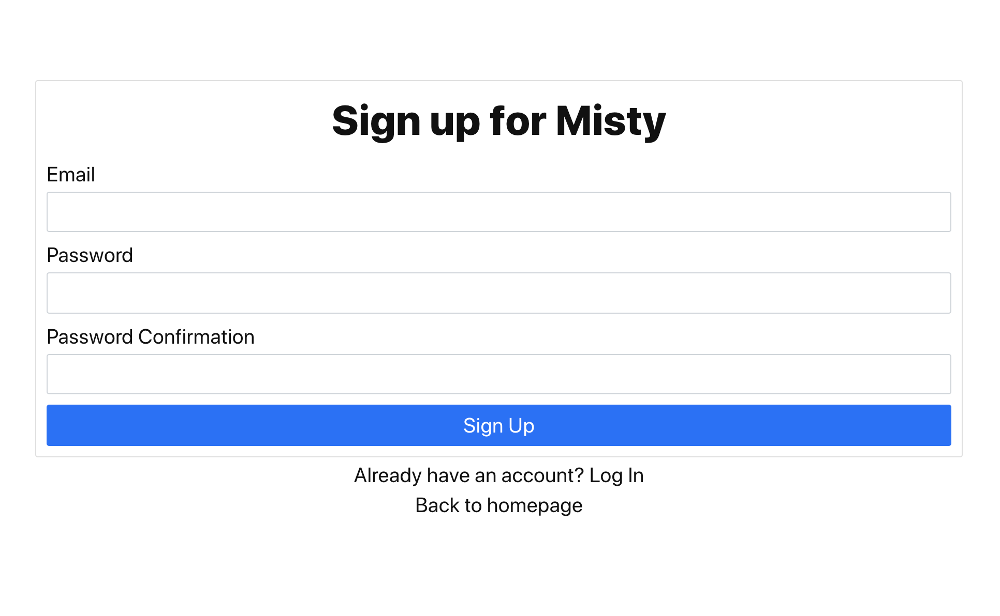

#

misty-app

This repository contains all the code for Misty, a personal finance app which helps users budget smarter. Here is a link to Misty - [misty-test.herokuapp.com/](https://misty-test.herokuapp.com/).

Misty uses [Plaid](https://www.plaid.com) to securely connect to bank accounts in US and Canada. Misty relies on [Google Firebase](https://firebase.google.com/) for the backend. In particular, Misty uses Firebase Authentication for handling user auth and Firestore as a document database.

This app was built using the [Plaid Quickstart](https://github.com/plaid/quickstarthttps://www.plaid.com) module on Github as a starting point. The landing page for Misty was built using [000kelvin/react-landing-page](https://github.com/000kelvin/react-landing-page).

To run Misty locally,

## 1. Clone the repository

Using https:

```
$ git clone https://github.com/adijp/misty-app.git
$ cd misty-app
```

## 2. Setting up keys and variables.

Misty requires API keys from both [Plaid](https://www.plaid.com) and [Google Firebase](https://firebase.google.com/).

### Plaid API keys setup

- Open `node/index.js`.
- Replace `PLAID_CLIENT_ID` and `PLAID_SECRET` with your own keys. If you are running it in
 development, set `PLAID_ENV = "development"`. You can either enter the keys directly into `index.js` or use environment variables.

### Firebase API keys setup
- Open `frontend/firebase.js`.
- Update the `config` variable with Firebase credentials.

## 3. Running the app

### Running the backend

```
$ cd node
$ npm install
$ node index.js
```

### Running the frontend

```
$ cd frontend
$ npm install
$ npm start
```

## Document Schema

Each user's data is a document in Firestore. Each user's document is made up of three collections :
- `accounts`
- `categories`
- `transactions`

If a user grants access to a bank account, an `access_token` is authorized and sent from Plaid to Misty. Misty stores each of the `access_token` in a field called `tokens`. Every time a user logs in, Misty uses the `access_token` to check if there are any new transactions with accounts associated with the tokens.

`accounts` has two documents, `cash` and `other` by default. If a user connects to their bank account using Plaid, each of their accounts is added as an additional document. Each account has the following fields:
```
account
  account_id : string,
  currency : string,
  current_balance : string,
  name : string,
  official_name : string,
  subtype : string,
  type : string
```

`categories` has 9 default categories. All transactions are by default categorized as `unclassified`. Users will have to manually designate a category to a transaction. Each category has the following fields: 
```
category
  active : bool, 
  balance : float, 
  budget : float, 
  id : string, 
  name : string, 
  type : "Spend" or "Save"
```

Misty only shows the set of categories where ```active == True```. When a category is deleted, ```active``` is set to ```False```. 

Each document in ```transactions``` has the following fields: 

```
transaction
  account_id : string,
  account_name : string, 
  amount : float, 
  category : string, 
  currency : string, 
  date : date, 
  name : string, 
  transaction_id : string
```

## Try the test environment

### Step 1: Sign up at [misty-test.herokuapp.com/signup](https://misty-test.herokuapp.com/signup) 


